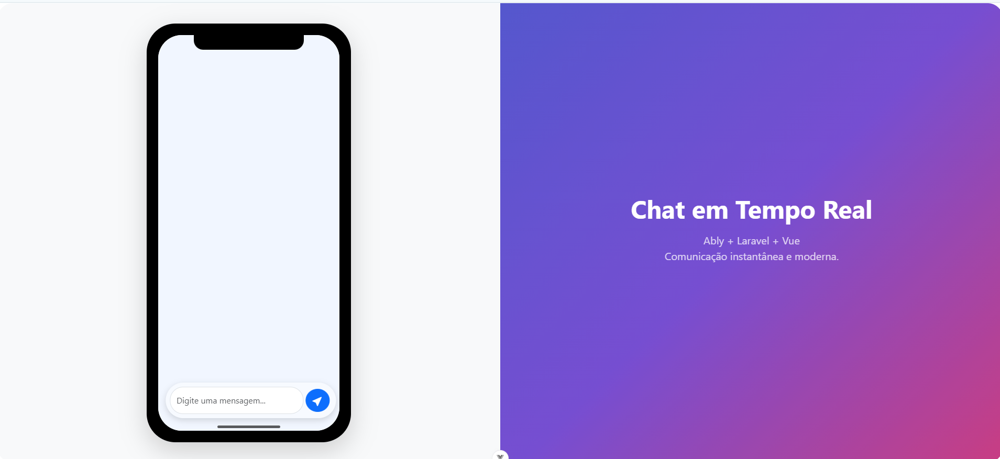

# Frontend Vue – Chat em Tempo Real



Este é o frontend do projeto **Chat em Tempo Real**, desenvolvido com **Vue 3 + Vite**, integrado ao backend em **Laravel** e utilizando **Ably** para comunicação instantânea.

## 🚀 Tecnologias Utilizadas

* **Vue 3** (Composition API)
* **Vite**
* **TypeScript**
* **Bootstrap**
* **Ably Realtime**

---

## 📦 Instalação do Projeto

```sh
npm install
```

## ▶️ Executar em Ambiente de Desenvolvimento

```sh
npm run dev
```

## 📦 Gerar Build de Produção

```sh
npm run build
```

---

## 💡 Requisitos Recomendados

### IDE

* **VS Code** + extensão **Vue (Official)** (desativar Vetur)

### Navegadores

* Chrome, Edge, Brave ou Firefox
* Instalar **Vue Devtools** para facilitar debugging

---

## 📝 Type Support para arquivos `.vue`

Como o TypeScript não entende `.vue` por padrão, o projeto utiliza o `vue-tsc` para verificação de tipos. A extensão Volar habilita o suporte completo dentro do editor.

---

## 🛠️ Personalização

Para personalizar opções avançadas, consulte a documentação do Vite:
[https://vite.dev/config/](https://vite.dev/config/)

---

## 📱 Sobre o Projeto

Este frontend simula um layout de chat mobile moderno, com suporte a mensagens em tempo real. O design inclui:

* Layout responsivo
* Interface inspirada em smartphones
* Envio e recepção instantânea de mensagens via Ably

---

## 📄 Licença

Uso livre para fins de estudo e aprimoramento profissional.
